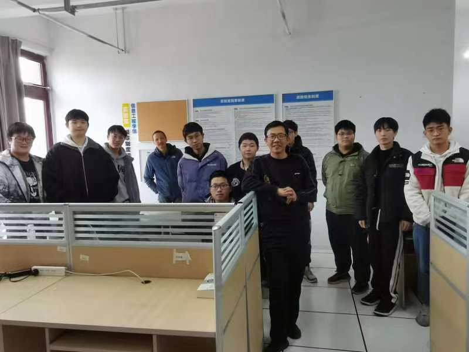

## 首页

:::tip
本电子书在github上开源，任何想改进此电子书的建议、Pull Request
都是欢迎的 :tada: :tada: :tada: 
:::

### 初期目标

这本电子书按照初期目标，暂时将目录分为以下四个部分：

- 软件开发、量化投资、机器人竞赛(竞赛大类)、常规资料

---

其中软件开发部分将主要注重于对技术的应用

- 可能更多的是关于实践的方法论
- 还有关于技术的实际使用
- 所以对于原理的部分不会进行过多的深入
- 这也需要发挥计算机的主观能动性—— **自学**

---

量化投资部分是关于江老师擅长的数据分析方向

- 运用各种思想去赚钱不也是一个很好的方向吗
- 同时还能学习更多回归的Ai信息

---

机器人竞赛实际上属于竞赛大类，主要指团队软件编码等竞赛

- 算法是程序员中的二流人员，也是我们常规学生难以达到的程度
- 关于软件编码更多是在于逻辑的处理、团队的协作上，可以培养处理问题的思维
- 虽然熟练的逻辑也只属于三流程序员，但对于本科程序员来说也是一个巅峰了

---

其中通用部分主要存储一些和三大主题不符的文档

- 比如这本电子书开发的一些步骤
- 一些计算机的基础理论
- 一些比较好的学习资源等

### 说在后面

这本电子书更多的是一个学习路径的参考, 
每个计算机的学生而言学习的路径都是不同的,
有人学的快、有人精通算法、有人钻研基础，
不同的学习方向带来不同的学习方法论，没有最好的，只有适合的。

### 实验室合照

**19-20**

### 致谢

|        姓名        | 老师 | 开发者 |
| :----------------: | :--: | :----: |
|       江左文       |  @   |        |
|       刘博文       |  @   |        |
| tacom(aprogrotess) |      |   @    |
|      qian160       |      |   @    |
|   Hoshino-fall     |      |   @    |

### 一些私货

> 这里主要留下一些我大学四年的所思所想，供他人参考 -- 2019 tacom 

我只是一个和大多数人一样的大学生，进入大学对未来充满希望，但随着每年不断的接触社会的过程中
感觉越来越心累的一个人。

在不断的实习过程中，我发现社会上想要成功，是需要很多的强大人际关系支撑的，
建立这个圈子，要么需要大量资金，要么有地位（包括官职、极高的学历），这些对于我这个三本的学生来说，
几乎是不可能的事情。

然后从技术方面来说，一流程序员学数学，二流重算法，三流逻辑，既然一流和二流程序员我难以达到，我从大二开始
就基本将学习重心转入开发。本来想着就算不能达到一个比较好的层次，起码也能达到一个中流的水平，但实际上还是事与愿违，
大学四年的疫情终究还是影响巨大，即便在2023放开的时候，社会上更多的是注重套现离场，以至于超大规模的程序员失业，
（微软为首裁员20w，国内则是以互联网大厂为主，基本砍了一半以上），应届生的就业空间几乎挤压完毕。

从就业地域来看，我前往了以下几个地区：

- 台州-宁海-宁波-慈溪-绍兴-义乌-杭州-嘉兴-苏州-上海-南京
- 宁波地区希望吸纳更多的顶级学历人才(对低学历友好程度不高)，对于计算机学科并不重视，更多适合经商、外贸、小语种前往。如果看着工资8000， 
  面试面完基本工资3500，我感觉基本上没人可以接受吧
- 杭州我毕业的时候不好判断，但从政府就业需求报告来看，更多需要4年的中高级开发，以及高学历人才，围墙很厚难以跨越。
  并且很多公司开设的目的是为了进行产品销售，难以判断真实计算机需求。
- 苏州是我这几个城市中感觉最好的一个城市，它没有宁波地区很明显的歧视，更多的在意你是否能解决问题，并且工作指向比较明确
  基本属于工业大类，理工科的学生感觉都可以去试试
- 上海是有最多岗位的地方，更多集中在金融、游戏但不在我的考虑范围
- 南京是一个学校很多的城市，但优秀的计算机院校很多（东南大学...），导致计算机外包很多，毕业一年内想练习技术可以前往
  找找机会
- 其余城市更多的在于承接，需求普工，以及机械类。我看完了这些城市后，起码江浙地区是工业城市是可以证实的，机械、PLC、电气
  等偏向硬件大类的学科可以很快的找到工作，但计算机软件的我判断只能在一线、新一线持续

就业市场如此混乱，我不清楚未来的发展情况，所以我需要提出以下几点建议：

1. 不能放弃技术的学习，即使暂时看不到变现的时机，放弃就是完蛋。
2. 选择就业的话一定得去看看公考、事业编，既然我们很难有所成就，最起码也要让自己过的健康，让家人不要担心。
   一边实习，一边公考是一个相当累的事情，实习中会遇到很多琐事，公考的难度也直线上升，但有机会摆着就该试试，
   管他是不是逝世，年轻人想那么多干吗。
3. 考研需要注意，考上双非不代表未来会有多好，疫情开始大家都想着有个缓冲期，未来硕士含金量会不断下降，
   所以考研可能开始就要瞄准中上211，或者双非博士起。这将负担很大的不确定性，如果家里支持可以拼尽一切去试试，
   如果没有考上记得选择培训一年在上岗，我这一届开始工作的难度就不再是应用技术，更多的还有从事一些很烦的业务方面、
   需求分析方面的内容，这些只有在实际中感受才能慢慢学会。

**大道至此，望大家再接再厉**
