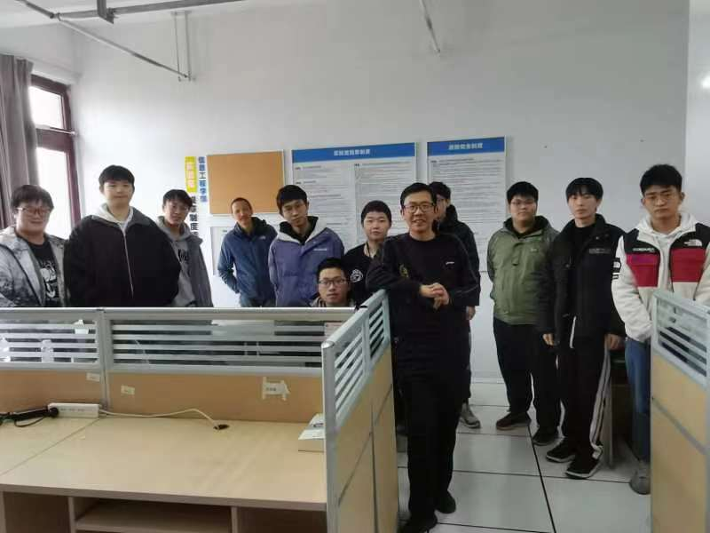

## 首页

:::tip
本电子书在github上开源，任何想改进此电子书的建议、Pull Request
都是欢迎的 :tada: :tada: :tada: 
:::

### 初期目标

这本电子书按照初期目标，暂时将目录分为以下四个部分：
- 软件开发、量化投资、机器人竞赛(竞赛大类)、常规资料

---

其中软件开发部分将主要注重于对技术的应用
- 可能更多的是关于实践的方法论
- 还有关于技术的实际使用
- 所以对于原理的部分不会进行过多的深入
- 这也需要发挥计算机的主观能动性—— **自学**

---

量化投资部分是关于江老师擅长的数据分析方向
- 运用各种思想去赚钱不也是一个很好的方向吗
- 同时还能学习更多回归的Ai信息

---

机器人竞赛实际上属于竞赛大类，主要指团队软件编码等竞赛
- 算法是程序员中的二流人员，也是我们常规学生难以达到的程度
- 关于软件编码更多是在于逻辑的处理、团队的协作上，可以培养处理问题的思维
- 虽然熟练的逻辑也只属于三流程序员，但对于本科程序员来说也是一个巅峰了

---

其中通用部分主要存储一些和三大主题不符的文档
- 比如这本电子书开发的一些步骤
- 一些计算机的基础理论
- 一些比较好的学习资源等

### 说在后面
这本电子书更多的是一个学习路径的参考, 
每个计算机的学生而言学习的路径都是不同的,
有人学的快、有人精通算法、有人钻研基础，
不同的学习方向带来不同的学习方法论，没有最好的，只有适合的。

### 实验室合照

**19-20**

### 致谢

| 姓名 | 老师 | 开发者 |
| :--:| :--: | :--: |
| 江左文| @ | |
| 刘博文 | @ | |
| tacom(aprogrotess) | | @ |
| qian160 | | @ |

### 一些私货
> 2019 tacom

这里主要留下一些我大学四年的所思所想，供他人参考
