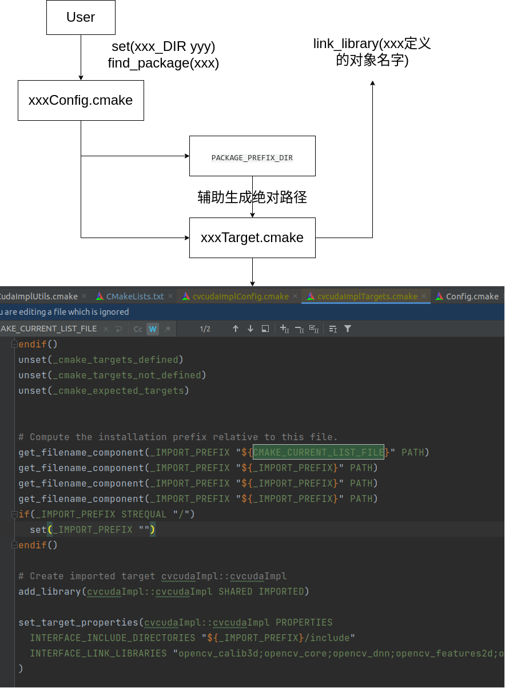
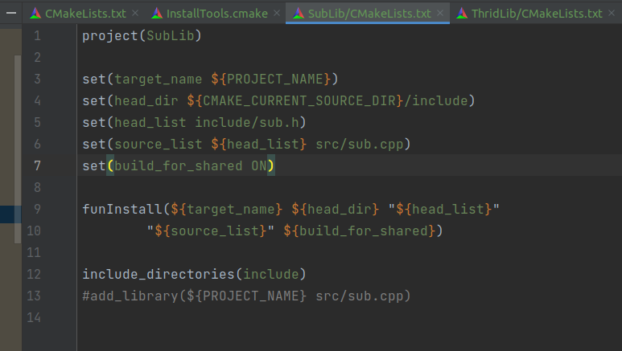
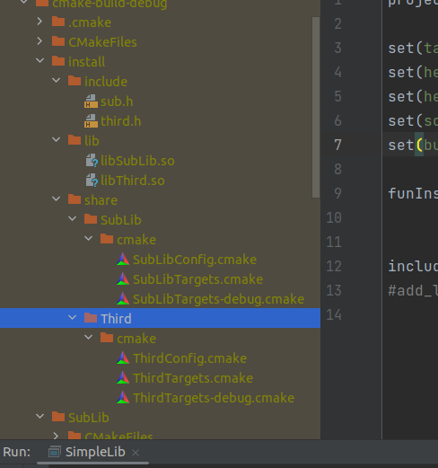

# 发布CMAKE标准的静态库和动态库

> 说是cmake标准，实际上是包发布者按照cmake的格式填写如何链接自己的库文件

## Cmake的xxxConfig.cmake文件

通常cmake标准的发布采用一个Config多个Target的方式

- Config通常描述了目标的相对位置
  - `get_filename_component(PACKAGE_PREFIX_DIR "${CMAKE_CURRENT_LIST_DIR}/../../../" ABSOLUTE)`
- 在使用`find_package`的时候，会从这个config文件的绝对路径开始，进行相对位置跳转
  - 如果库文件繁多，那么就会有很多的相对路径跳转了
  - 我个人能力有限，基本只能写一些简单的，所以生成出来的就会有一定的可读性
- xxxTarget.cmake会被加入到config中
  - `include("${CMAKE_CURRENT_LIST_DIR}/cvcudaImplTargets.cmake")`
  - 这样子导入config的时候，会同步初始化**子模块**
  - 每个target实际上就是代表着子模块用到了那些头文件，库文件等，方便后续使用者进行导入


## 图示




## 为SimpleLibInteract生成cmake标准的库文件

> 为了他人的方便调用，通常自己就会麻烦，这也是程序界的麻烦之一

### 封装安装函数

> cmake标准安装比较通用，并且每次需要书写的脚本比较多，所以封装成函数更好点
>
> 有些时候cmake的变量传递是一个很奇怪的事情，注意多使用message命令进行调试

这个函数很长，但是可以跟着示例图来看，这里大致解释一下：

1. `target_include_directories`: 这里的写法比较特殊，实际上是声明安装后调试时头文件的搜索路径(否则会来找工程的头文件，工程文件一旦移动、修改，直接嘎)
2. `set_target_properties`: 函数名字比较直观，实际上就是一个映射表，会被后续的函数捕获用来修改一定的编译行为
3. `install`: 安装函数的重载形式比较多，通常分为TARGETS以及FILES模式，一个就是代表一组内容，FILES就是用户自定义安装文件啦
   - 至于它到处的target，就看上面的图示就好，用来划分模块的
   - 还有`xx.cmake.in`他的语法和常规cmake不同，主要在导入自己的模块的时候判断依赖是否全了等逻辑操作

```cmake
# InstallTools.cmake
# 下面通常放在最外面的cmake初始化一次就好了
# 导入cmake标准库，这里面的常量通常用于标准库的名字指定
include(GNUInstallDirs)
# 创建config文件用的
include(CMakePackageConfigHelpers)
# 设置文件安装位置
set(CMAKE_INSTALL_PREFIX ${CMAKE_CURRENT_BINARY_DIR}/install)

function(funInstall
        target_name
        head_dir
        head_list
        source_list
        build_for_shared
        )

    # funInstall 函数名字
    # target_name, 模块的project_name
    # head_dir, 头文件路径
    # head_list, 头文件列表
    # source_list, cpp文件列表用于编译
    # build_for_shared, 是否编译为动态库


    message(STATUS "${target_name} Input info list: ")
    message(STATUS "  Target name: ${target_name}")
    message(STATUS "  Head dir: ${head_dir}")
    message(STATUS "  Head list: ${head_list}")
    message(STATUS "  Source list: ${source_list}")
    message(STATUS "  Build shared: ${build_for_shared}")


    # 创建对象，并指定生成的库文件类型
    if(${build_for_shared})
        add_library(${target_name} SHARED ${source_list})
    else()
        add_library(${target_name} STATIC ${source_list})
    endif()

    # 设置安装的cmake头文件搜索路径(相对搜索)
    # 注意用法和常规的不同
    target_include_directories(${target_name}
            INTERFACE
                $<BUILD_INTERFACE:${head_dir}>
                $<INSTALL_INTERFACE:${CMAKE_INSTALL_INCLUDEDIR}>
    )

    # 设置需要安装的头文件
    # 这里还能设置许多编译行为
    set_target_properties(${target_name}
            PROPERTIES
                PUBLIC_HEADER ${head_list}
                LINKER_LANGUAGE CXX
    )

    # 设置安装属性
    # 并安装相关lib以及head
    # 同时导出target
    install(
            TARGETS ${target_name}
            EXPORT ${target_name}Targets
            PUBLIC_HEADER DESTINATION ${CMAKE_INSTALL_INCLUDEDIR}
            RUNTIME DESTINATION bin
            LIBRARY DESTINATION lib
            ARCHIVE DESTINATION lib
    )
    # 如果设定target的头文件属性，就可以按照下面的写法手动安装
#    install(FILES ${head_list} DESTINATION ${CMAKE_INSTALL_INCLUDEDIR})

    # 安装target对象，并设定供外界使用的命名空间
    install(
            EXPORT ${target_name}Targets
            FILE ${target_name}Targets.cmake
            DESTINATION ${CMAKE_INSTALL_DATADIR}/${target_name}/cmake
            NAMESPACE ${target_name}::
    )

    # 生成config文件
    # 这里的cmake.in实际上是自己的target模块搜索方法
    # 这里偷懒直接网上考了一个
    configure_package_config_file(
            ${CMAKE_SOURCE_DIR}/cmake/NeedOpenCV.cmake.in
            ${CMAKE_CURRENT_BINARY_DIR}/${target_name}Config.cmake
            INSTALL_DESTINATION ${CMAKE_INSTALL_DATADIR}/${target_name}/cmake
    )

    # 安装config文件
    install(
            FILES ${CMAKE_CURRENT_BINARY_DIR}/${target_name}Config.cmake
            DESTINATION ${CMAKE_INSTALL_DATADIR}/${target_name}/cmake
    )


endfunction()
```

### 函数使用



封装好以后，用起来就不会特别痛苦了，可以看到实际上告诉函数头文件在哪找，那些cpp要拿去编译（和导入一样的）


### 执行结果

> 如果到了这一步，恭喜封装完成了cmake方式的库分发，后续他人设定xxx_DIR后就可以使用find_package导入

