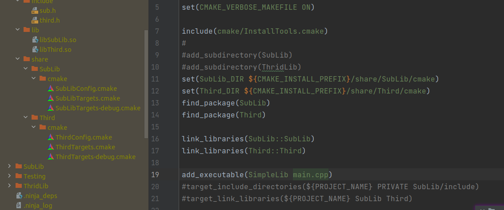
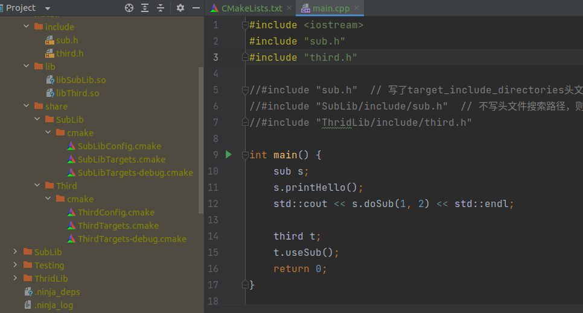

# 链接CMAKE标准的静态库和动态库

> 相对来说链接cmake标准的库文件就会相对方便点（工程比较大的情况下)

## 修改SimpleCmakeInstall

> 选择这个程序，主要是会遇到两个问题：
>
> 1. 和上一节一样，动态库搜索不到，编译通过无法运行的问题
> 2. rpath问题，库文件相互依赖A->B->C，然后B找不到C的情况

和上一节一样，直接修改最外层cmake，让main.cpp链接目标对象

由于在config中已经自行链接了头文件路径，以及库文件

- 我们只要简单的`link_libraries(命名空间::Target)`就能导入所有的符号
- 甚至不用手动填写头文件搜索路径了，main中直接使用






## 烦人的rpath

> A->B->C，rpath实际上就是告诉B你的C去哪里找，编译B的时候加上
>
> CMAKE中还有隐式链接可以避免这个问题，但是没研究透所以不贴了

[参考的rpath设置方式](https://blog.csdn.net/zhangzq86/article/details/80718559#:~:text=%E9%BB%98%E8%AE%A4RPATH%E8%AE%BE%E7%BD%AE%20set%20%28CMAKE_SKIP_BUILD_RPATH%20FALSE%29%20%23%20%E7%BC%96%E8%AF%91%E6%97%B6%E5%8A%A0%E4%B8%8ARPATH%20set%20%28CMAKE_BUILD_WITH_INSTALL_RPATH,%22%22%29%20%23%20%E5%AE%89%E8%A3%85RPATH%E4%B8%BA%E7%A9%BA%20set%20%28CMAKE_INSTALL_RPATH_USE_LINK_PATH%20FALSE%29%20%23%20%E5%AE%89%E8%A3%85%E7%9A%84%E6%89%A7%E8%A1%8C%E6%96%87%E4%BB%B6%E4%B8%8D%E5%8A%A0%E4%B8%8ARPATH)

```cmake
set(INSTALL_LIB_DIR "${PROJECT_BINARY_DIR}/lib") # 假设安装目录在编译目录的lib子目录内
 
set(CMAKE_SKIP_BUILD_RPATH FALSE)  
set(CMAKE_BUILD_WITH_INSTALL_RPATH FALSE)  
set(CMAKE_INSTALL_RPATH "${CMAKE_INSTALL_PREFIX}/lib")  
set(CMAKE_INSTALL_RPATH_USE_LINK_PATH TRUE)
 
# 确保链接库不在系统默认安装的目录上时更改到项目lib上
list(FIND CMAKE_PLATFORM_IMPLICIT_LINK_DIRECTORIES ${CMAKE_INSTALL_RPATH} isSystemDir)  
if("${isSystemDir}" STREQUAL "-1")  
  set(CMAKE_INSTALL_RPATH "${INSTALL_LIB_DIR}")
endif("${isSystemDir}" STREQUAL "-1")  
```


## congratulation

至此cmake最重要的部分，你已经学完了，后面更多的是进阶内容

- 比如，如何在配置的时候自动下载包
- 设定跟多复杂的函数等
