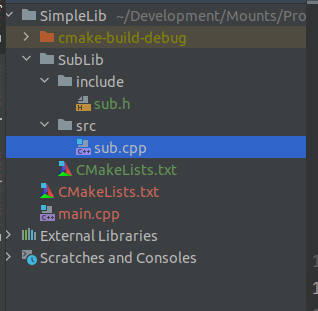
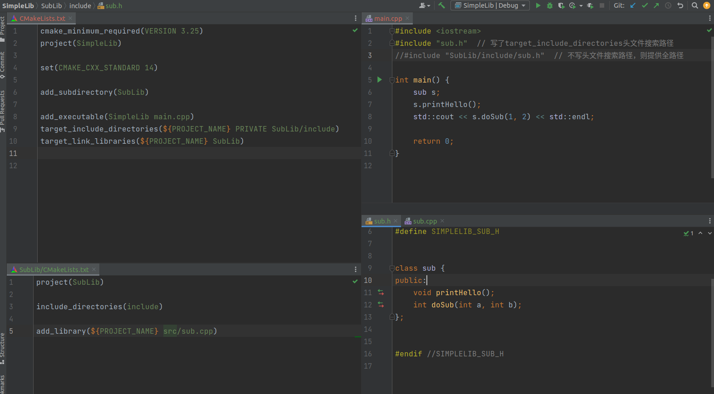
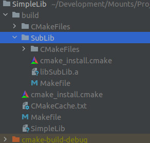
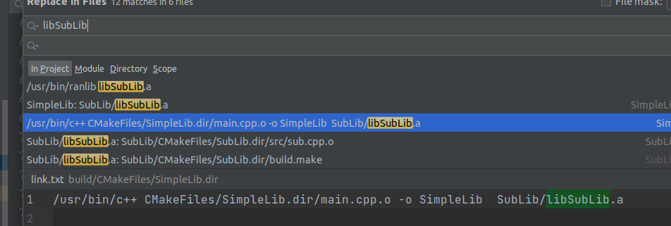

# CMAKE组织子模块

## 建立文件结构



```
SimpleLib
	|- SubLib
		|- CMakeLists.txt
		|- include
			| - sub.h
	    |- src
			| - sub.cpp
	|- main.cpp
	|- CMakeLists.txt
```

简单的来说就是用`main.cpp`去调用`SubLib`里的内容

- cmake使用是`多叉树`来表示各个子模块，这也带来了一个问题
  - 就是`Project`创建的`Target`对象是全局的，但平行的子节点间无法访问对方的编译变量信息
    - 这有时会带来一个比较棘手的编译问题（常出现在三方模块的编译信息需要联动的情况下)
    - 这时就需要提交给顶部节点(对外层的cmake)进行中转，或者使用`cmake`的`cache`系统


## Cmake解析



- 子模块(SubLib)`的cmake使用`include_directories将头文件搜索路径加入，从而让`sub.cpp`知道自己的头文件在哪里，并编译cpp为一个lib
- 主cmake将**路径**`SubLib`，加入此工程中，cmake立刻进入此目录递归搜索模块，发现了子模块的对象名字`SubLib`
- 主cmake将main.cpp编译成可执行文件，并告诉编译器`main.cpp`需要的头文件来自`SubLib/include`文件夹，需要链接的Target是`SubLib`


## 编译生成的文件



- 子模块在cmake的指挥下，编译成了一个叫`libSubLib.a`的静态库



- 以及在cmake的指挥中，被g++链接到了主程序二进制中并最终生成执行文件
