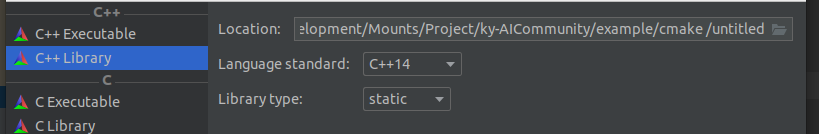
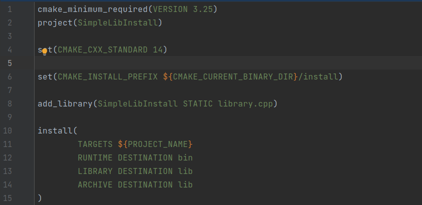
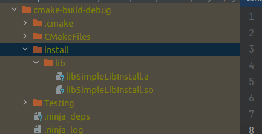
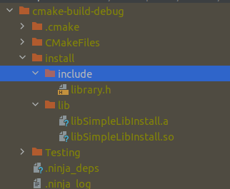

# 发布自己的静态库和动态库

::: tip

本节介绍模块的lib/so文件如何生成到指定目录

::: 

## 库文件的发布标准

和其他一些有库管理的语言不同，比如python发布时采用whl文件，java则打包成jar文件供他人调用

c/c++的包发布就随意的多(实际上这种方式不太好，别人怎么链接都一脸蒙蔽)，所以下面一个文章就是关于发布cmake标准的包

c/c++的包管理也是有其他方式的，比如vcpkg方案，conan方案，这些都得自己去学习下，然后看看适不适合吧

## 跨平台的发布方式

1. 对于linux环境，由于每个linux发行版本的内核代码不同、支持的c/c++标准不同，系统动态库的版本不同，通常采用开放源代码编译的方式进行发布
   - 当然使用现在火热的docket技术进行发布也是可以的
   - 或者采用能跨全linux平台的AppImage方案(也没那么万能)
2. windows，win是一个很神奇的东西，静态库和动态库创建的时候，自动加入系统的部分代码，导致可以在同一个版本下的系统间随意移动（相对来说，文件大小也会大很多）
   - 如果想在linux状态下发布win标准的库文件，请参考网络上的cmake使用交叉编译器

## 从示例项目开始

> 这里直接使用clion的示例项目

如果不采用cmake标准的包发布，那么cmake的书写方式就会相对简单:

可以看到，修改的内容如下：

- 第六行，指定了库文件的安装路径（编译目录下的install目录)，如果不指定，默认安装到系统路径中
- 第八行，指定了这次需要生成静态文件(如果改成SHARED就会生成动态库文件)
- 第十行，指定了我们需要安装的target对象，以及安装目标的目录名字

点击左上角的build-Build project后，就可以点击build-install安装自己的库文件了

- 当然要给别人用的话，头文件需要自己复制过去

不采用cmake标准的话，通常只能自己编译一些小模块，多了就不太妙了，并且别人要使用的话不能使用cmake的find_package语法快速导入，还要设定lib库的路径以及完整的库文件名字，这就比较蛋疼了。
