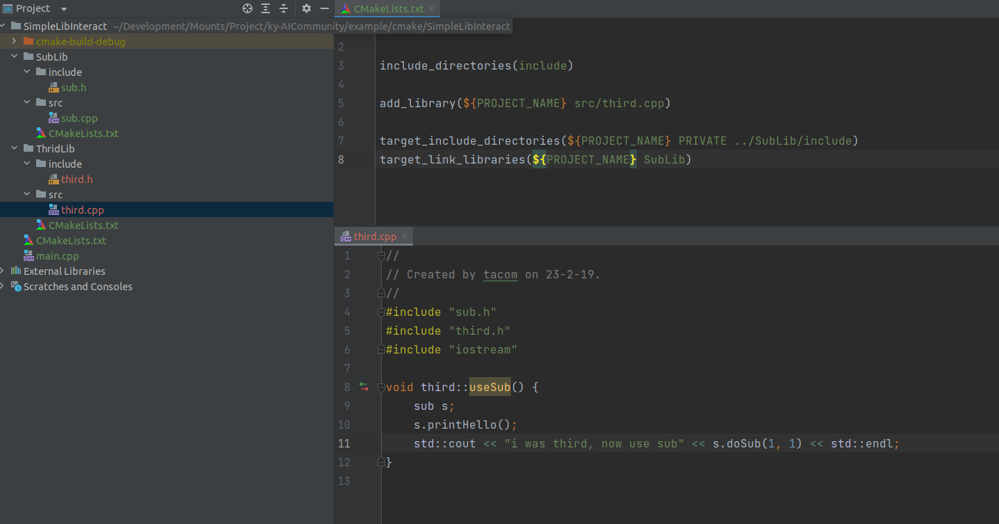
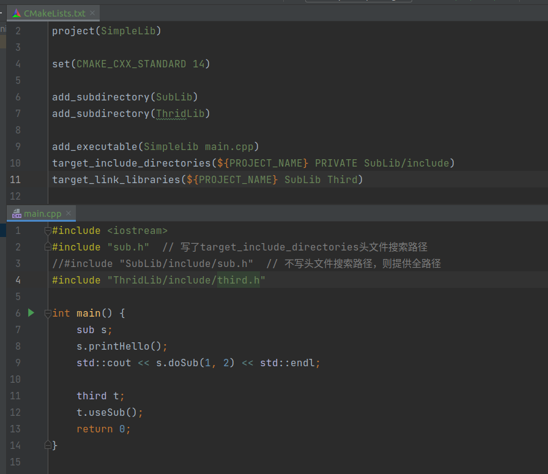

# CXX子模块间的调用

::: danger

cxx子模块间的相互调用请小心，如果出现`A need B` 同时`B need A`时，会出现递归include，编译报错

最好的处理方式，是将两者共同的东西进行抽离，否则使用一个预编译指令，让这个文件只能在编译的时候加入一次语法树

:::

## 创建第三个模块

在[SimpleLib](./SimpleLib.md)的基础上，我们添加一个新的文件夹

- 
- 此模块的目的就是调用以下SubLib的内容

## 解析

- 此实现很简单，和`main.cpp`调用`SubLib`一致，添加库的头文件搜索路径，以及添加一个全局的`Target`对象
- 就可以完成包之间的相互调用了

对于最外层的修改也是比较简单的：

- 简单增加以下自己的`project(模块名称)`就好了

