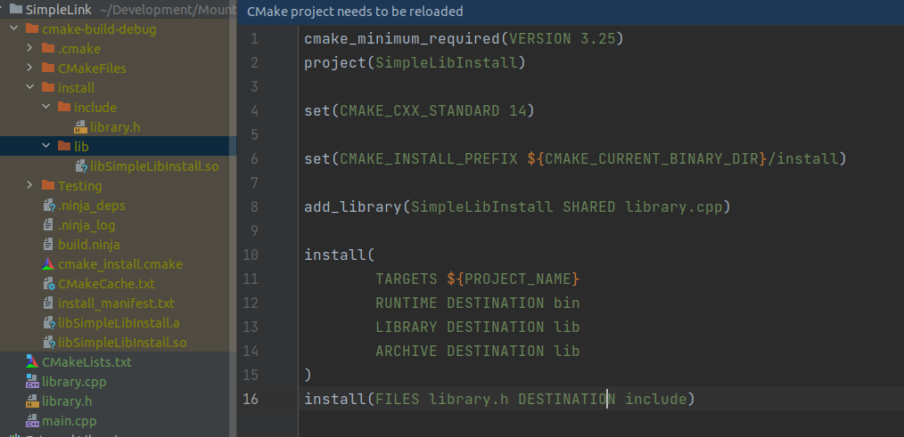
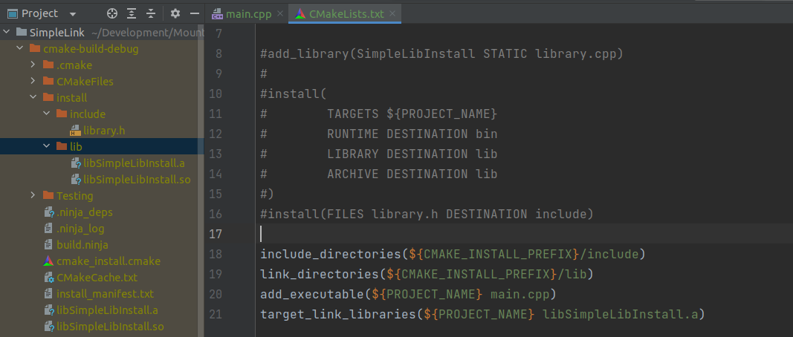
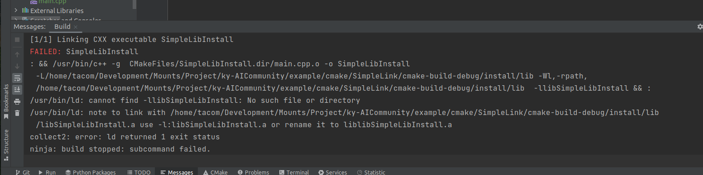

# 链接常规的静态库和动态库

> 常规的链接方式实际上就是往编译语句里增加-L -l之类的东西
>
> cmake则是用来生成这些搜索路径以及链接目标的脚本

## 链接SimpleLibInstall

- 我们首先安装原先的代码，然后修改此cmake，增加main.cpp用于模拟链接

## 修改的cmake

- 非常无脑的使用方法，加载头文件，库文件的搜索路径
- 然后指定需要链接的库文件名字

## 运行时异常

> 通常在链接动态库的时候出现的问题，注意是编译通过运行直接爆炸的情况阿，编译没过会提示xxx没找到

编译库文件没找到是这样子的：

运行时异常，主要在于linux的动态库搜索路径问题上，和win不同，linux不会直接搜索执行文件同级目录等相关位置

- 如果没找到，那程序只能一场退出了
- linux状态下，安装在非系统位置的库文件，基本上都要编辑`/etc/ld.so.conf`文件让此路径加入程序运行时依赖的搜索路径

- 这里贴一个[linux库文件搜索顺序](https://blog.csdn.net/Once_fish_/article/details/122805687#:~:text=%E7%BC%96%E8%AF%91%E6%97%B6%EF%BC%8Cld-linux.so%E6%9F%A5%E6%89%BE%E5%85%B1%E4%BA%AB%E5%BA%93%E7%9A%84%E9%A1%BA%E5%BA%8F%EF%BC%9A%201%20ld-linux.so%E7%94%B1gcc%E7%9A%84spec%E6%96%87%E4%BB%B6%E4%B8%AD%E6%89%80%E8%AE%BE%E5%AE%9A%202%20gcc%20--print-search-dirs%E6%89%80%E6%89%93%E5%8D%B0%E5%87%BA%E7%9A%84%E8%B7%AF%E5%BE%84%EF%BC%8C%E4%B8%BB%E8%A6%81%E6%98%AFlibgcc_s.so%E7%AD%89%E5%BA%93%E3%80%82%20%E5%8F%AF%E4%BB%A5%E9%80%9A%E8%BF%87GCC_EXEC_PREFIX%E6%9D%A5%E8%AE%BE%E5%AE%9A%203,grep%20SEARCH%E2%80%9D%E6%9D%A5%E6%9F%A5%E7%9C%8B%EF%BC%89%205%20%E4%BA%8C%E8%BF%9B%E5%88%B6%E7%A8%8B%E5%BA%8F%E7%9A%84%E6%90%9C%E7%B4%A2%E8%B7%AF%E5%BE%84%E9%A1%BA%E5%BA%8F%E4%B8%BAPATH%E7%8E%AF%E5%A2%83%E5%8F%98%E9%87%8F%E4%B8%AD%E6%89%80%E8%AE%BE%E5%AE%9A%E3%80%82%20%E4%B8%80%E8%88%AC%2Fusr%2Flocal%2Fbin%E9%AB%98%E4%BA%8E%2Fusr%2Fbin%206%20%E7%BC%96%E8%AF%91%E6%97%B6%E7%9A%84%E5%A4%B4%E6%96%87%E4%BB%B6%E7%9A%84%E6%90%9C%E7%B4%A2%E8%B7%AF%E5%BE%84%E9%A1%BA%E5%BA%8F%EF%BC%8C%E4%B8%8Elibrary%E7%9A%84%E6%9F%A5%E6%89%BE%E9%A1%BA%E5%BA%8F%E7%B1%BB%E4%BC%BC%E3%80%82%20%E4%B8%80%E8%88%AC%2Fusr%2Flocal%2Finclude%E9%AB%98%E4%BA%8E%2Fusr%2Finclude)

