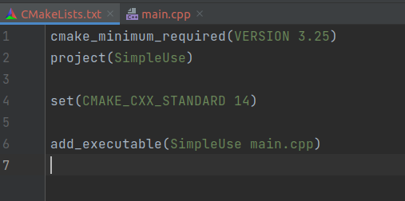
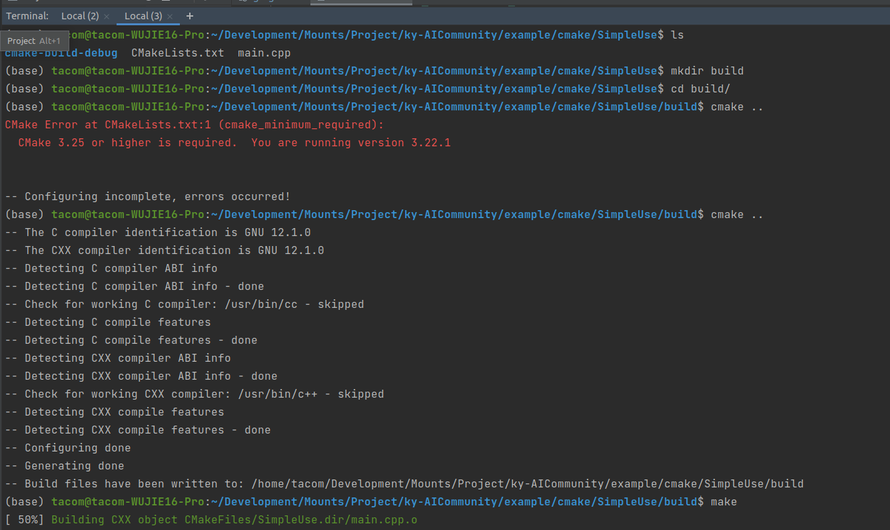
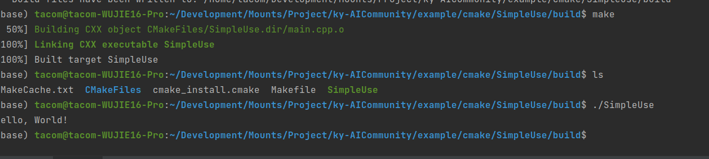
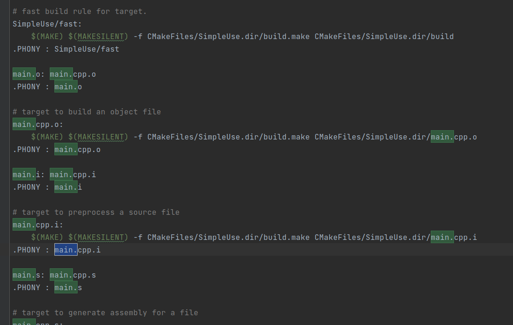
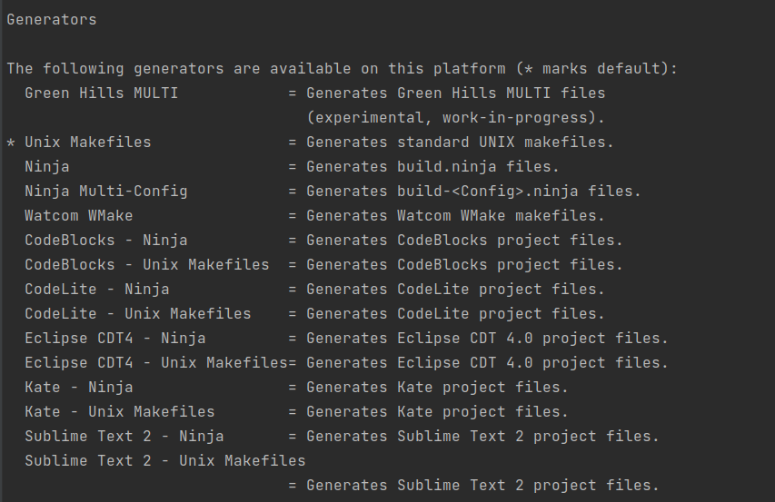

# CMAKE的简单使用

## CMake语法结构

对于一个简单的cmake，至少需要提供以下几个对象：

1. cmake版本信息（版本代表能够使用一些较为方便的函数，通常在[官方函数文档](https://cmake.org/cmake/help/latest/index.html)询使用方法的时候会注明)
   - 这一条通常在最外层的一个`CMakeLists.txt`中添加一次即可
2. 指定模块名称`project`，cmake通过模块名称进行资源划分，比如`main.cpp`现在就归属于`SimpleUse`模块中
   - 如果其他模块想要使用`main.cpp`的内容，就需要对方的模块名称填入(后面会说怎么链接)
3. 指定此模块的CXX特性版本
   - 这里会对生成的编译指令有所影响，代表cxx标准组织实现的特性列表
4. 此模块需要被编译成什么目标(`Target`)
   - `add_executable`代表此模块下的资源会被编译为[elf](https://zhuanlan.zhihu.com/p/286088470), 也就是常说的二进制可执行文件

## Compile

对于任意一个**编写良好cmake工程**，只要在项目最外层，执行以下命令即可:

1. 创建一个文件夹，用来生成编译脚本的相关中间文件
2. 在linux环境下，默认生成的对象是`Makefile`文件，可以调用`make`命名，执行里面的gcc/g++过程
3. 由于在cmake中没有执行elf的安装位置，所以会生成在中间文件目录
4. `./SimpleUse`执行，得到`Hello world`输出

## 关于Makefile

这是一种更多用来Linux以及标准c/c++编译器上的执行流程，它描述了一个cpp文件如何一步步转换到汇编，以及最后的elf，并给每个步骤添加了执行指令，如果使用非标准的`c/c++`编译器，就需要在执行`cmake ..`时添加`-G`来指定生成的目标编译工程文件

- 
- 

