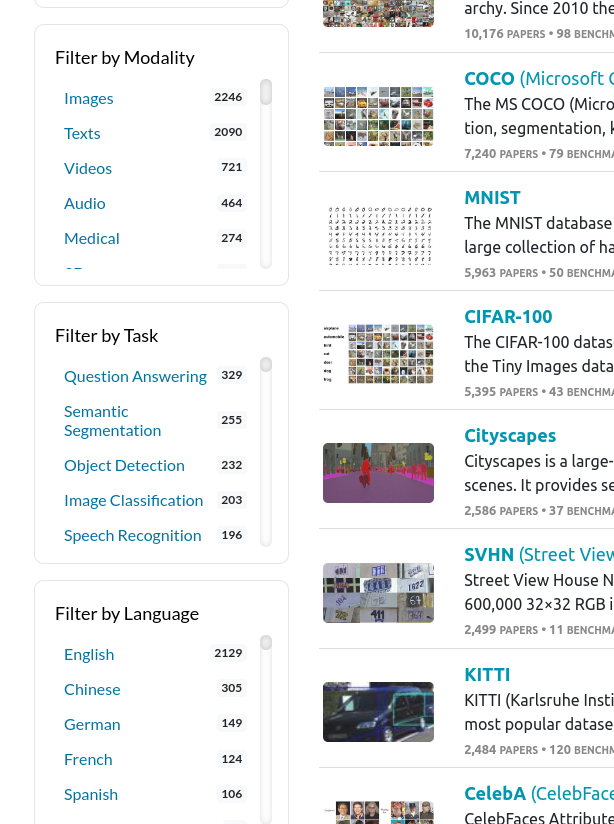
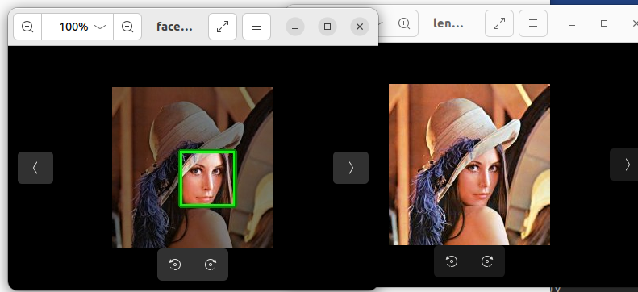
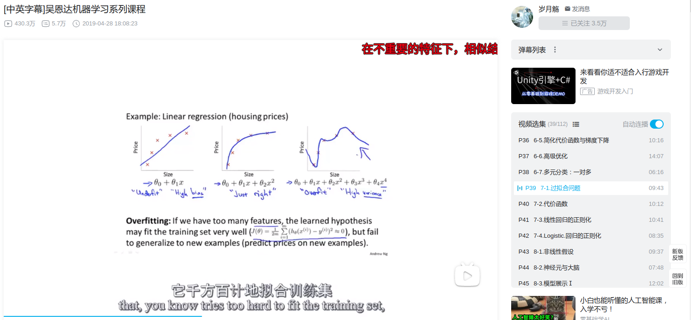
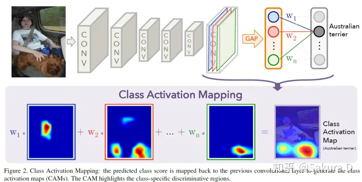

# 如何作成一个AI项目

::: tip
做好一个AI项目说简单也简单，无非就以下这么几个步骤：

1. 问题归类
2. 搜集数据集 (研究这个问题的数据集论文，有些要发邮件)
3. 搜集相关模型实现论文
    - 论文复现 (或者开源的重新训练)
    - 模型调优（包括精度、泛化能力、模型裁剪等)
    - 模型验证 (模型的可解释, 表示学习的特征是对的)
4. 模型部署(模型的各种部署方式)
5. 嵌入目标业务系统(python, cxx可以直接嵌入，其他一般开网络api)

但每个步骤都需要大量的知识储备、踩坑过程，我作为一个本科生完全没有自信完全解决一个AI项目
但可以留下大致的处理方案，供后人参考
:::

## 问题归类

**问题的归类**实际上是**问题分解**的后续操作，计算机的很多问题整体来看是很难处理和解决的，但一旦把问题进行模块划分，描诉好模块交互关系后，剩下的实现一般就是时间上的问题，这个能力就是开发者的最初一个重要能力，需要大量的实践经验以及广泛的知识基础。

对于分解好的模块，下一步需要知道的是用什么技术/方法可以达到这个目的，或者有很多可能待实践的方法

- 这里推荐[paperswithcode](https://paperswithcode.com/)，它搜集了大量的AI学习任务，以及相关的研究论文
- ai的细分任务呈现倍数增长(我21年大二的时候才几百个)
- 这些细分领域如果不是很了解的话，问老师就对了，普通人真的做不到每个分支都十分明白



对于扩充自己的AI领域知识，我推荐B站的宝藏up主:


## 搜集数据集

数据集是一个Ai问题的另外一个难点，即便在2000多个细分类别中，处理一个实际问题需要的数据集，也很容易**找不到**

开源数据集通常代表着一个领域的重头，但是对于实际来说，还是不够的精细

然后一个好的数据集又是一个好模型的关键，所以在数据量不够的时候出现了很多方法

### 自行拍摄数据集

自行制作的数据集通常需要以下几个条件：

1. 拍摄的原图分辨率一定要高
   - 后续可裁剪，如果分辨率低了，那就没救了
2. 需要具有空间视角(别光正面对这拍，即便流水线的相机也很难直接正面采集目标图像)
   - 可以直接录视频，后续处理麻烦点
3. 注意光照对拍摄的影响，这也是影响后续检测精度的一个重要条件（否则工厂的检测一般就不打光了）

### 采用GAN进行图像增广

> [GAN的数据增强](https://zhuanlan.zhihu.com/p/353430409)

GAN网络通常用于某种生成任务，比如CycleGaN就可让图片的风格全部变换，但保留图像的核心内容不变

- 但GAN的生成质量很难控制住，用GAN进行数据增光也是一个很好的研究方向

### 加入更多的特征强调方法

> 这里即可以强调特征，又可以将平时难以采集到的图像生成出来，用来训练

有些时候，一个图像中有很多的物品，我们只想让模型关注一部分。如果直接拿去训练，时间长了，才可能得到一个目标结果。

一般采用的方法是对原图进行一些常规的CV操作，把所要学习部分像素值调高，其他区域降低。然后和原图一起混在一块，当然标签也是和原图一样的，这样子送入模型进行训练。

好处就是直接增加了模型的训练文件数量，然后还能一定程度加速模型的训练速度。

我们假定实现一个判定网络，判定图片中是否存在一个脸，我们首先通过常规的cv操作，找到脸部，然后将其他的像素数值降低50%, 然后将两个图送入网络，标签都些有脸，通常模型的收敛速度会快些一些。

```python
import cv2 as cv
import numpy

img = cv.imread("lenna_img.jpg")
gray = cv.cvtColor(img, cv.COLOR_BGR2GRAY)

face_cascade = cv.CascadeClassifier(
    r'/home/tacom/Development/Envs/anaconda3/envs/janpos/lib/python3.9/site-packages/cv2/data/haarcascade_frontalface_default.xml')
# 检测脸部
faces = face_cascade.detectMultiScale(gray,
                                      scaleFactor=1.1,
                                      minNeighbors=5,
                                      minSize=(30, 30),
                                      flags=cv.CASCADE_SCALE_IMAGE)
print('Detected ', len(faces), " face")
for x, y, w, h in faces:
    img = cv.rectangle(img, (x, y), (x + w, y + h), (0, 255, 0), 3)

    mask = numpy.ones(img.shape, dtype=numpy.bool)
    mask[y: y + h, x: x + w] = False
    img[mask] = (img[mask] * 0.5).astype(numpy.uint8)

cv.imwrite("face.jpg", img)
cv.imshow('img', img)
cv.waitKey(0)
cv.destroyAllWindows()
```



### 常规的图像增广方法

> [Pytorch进行数据增广](https://blog.csdn.net/weixin_40793406/article/details/84867143)

这个部分的内容就很多了，通常Ai的开发不会去现场采集数据集，但是一线采集的数据通常没有需要训练的信息，那么可以通过一些算法来弥补。比如弥补一些角度数据缺失、光照数据的缺失、图像的遮挡等图片


## 论文的复现

### 论文的快速选择

ai的论文成功复现百分比为20%左右，所以除非找到比较符合的论文，需要精度、复现以外，最好在看完这几个部分后跳过:

1. 引论部分，明白这个论文是针对什么细分任务写的
2. 试验数据部分，这篇论文有实验数据支撑的话，通常就具备一定的复现可行性，同时还能知道这个任务已经被实现到什么程度了，是不是够现在用的
3. 引用部分，如果这篇论文是你想实现目标的相关论文的话，他的论文引用部分肯定会给你带来一定的惊喜

### 自行复现论文


这需要大量的练习， 通常如果是做项目的华就不推荐了，这需要完全了解这一个方面的知识，同时具备复现能力。

这里推荐宝藏up主，如果想继续走ai方向的话，推荐自行从简单的论文进行实现

### 从开源代码开始调整

也是就常说的微调，从现有的代码，现有的权重下，对自己目标的数据集进行训练。

这对于需要一个大量试错的项目来说，是执行的最优解(但通常这些论文只有比较出名的才会有)

- 可以去[Pytorch搜录的模型库](https://pytorch.org/hub/)看看, Pytorch收录的模型通常是在生产中得到应用并有成效的模型
- 如果通过这些方案的整合（多个模型顺序执行）能实现目标的话，也是一个很好的选择


## 模型调优

### 模型的评价指标

> 这里更多的应该是任务的评价指标，通常每个细分任务带来的评估好坏方式也不同
>
> 但如果没有很好的评估方式，根据任务套用常规的分类/回归评估方案也是一个不错的选择

#### 分类问题的评估指标

> [知乎上总结的分类问题评估方式](https://zhuanlan.zhihu.com/p/69101372)

分类问题简单来说，就是目标有没有被正确的区分出来，通过这个方式来评估模型是否达到一个可以用的程度。

这些指标有些挺复杂的，本人学艺不精，就不详细说了。

二分类的评估指标是可以进行泛化的，比如多分类问题、YoLo中评估目标框的准确性，分割任务中每个像素是否判别正确之类的（虽然通常用IOU来判定，但本质就是划分的区域是否达到目标，有没有错误之类的)

#### 回归问题的评估指标

> [回归问题基本描述数值的偏离程度](https://blog.csdn.net/ZZ_Panda/article/details/118704516)

通常回归任务在训练的时候，数值需要进行归一化缩放，否则通常大的离谱，导致训练的时候容易起飞爆炸。

回归任务通常很难转换到分类指标，除非手动设定阈值

- 比如房价预测，到达了实际的80%算为正样本

- 所以方差（数值的偏离程度)成为了评估好坏的一个重要方式

### 模型的泛化

> 吴恩达的机器学习课程就很好的回答了这个问题



在从前只有常规数学方法实现类人工智能的时候，通常都是对一串数学公式的参数进行调整

- 现在的深度学习模型看不出来而已，其实也是一堆矩阵乘法，可以整合为一个/多个数学公式

从数学公式来看，训练的过程就是让公式的参数尽量穿过更多的向量(二维向量就是点，三维向量就是空间中的点，在高就只能从数学公式上来看了)，如果曲线扭的太厉害的话，偏离正常数值一点的目标，都有可能被判定为负样本(这显然不合理)

机器学习中有很多正则向用于控制模型的训练，我主要讲述如何在深度学习中加入和正则项作用一样的东西，让模型更加的稳定：

- BatchNorm2D: 让运算的时候每个输入此函数的矩阵数值都进行一定的正太化（通常矩阵输出的都是正太分布的数据是比较好的结果)，如果有异常点就会导致矩阵的某些参数过大，很多时候这是一个正反馈的过程，导致其他特征无法学习，模型最终出来的结果对某一类的识别比较好，其他都不行
- 对于Loss设定一个函数，在初期到中期的时候比较大，然后慢慢减小，这种手法通常用在数据不均匀，模型又比较难训练的情况下(GAN)
- [参考链接](https://blog.csdn.net/zyq11223/article/details/90416394)


### 模型裁剪(知识蒸馏)

> 这部分就比较抱歉了，大三开始就没有足够的时间在AI的学习上了

这部分的知识提出，主要在于NLP领域的Transformer类模型大量出现，其巨大的参数量、又具备比较高的商业价值。

为了能让更多的人加入赚钱，减少企业的硬件成本，提出的一系列权重优化方法，听说可以在NLP领域快速降低模型的参数量（变相降低硬件负担)


## 模型验证

> 精力不够，需要后续人员来完善此文档了

#### Grad-Cam

> [导航链接](https://zhuanlan.zhihu.com/p/105373864)，这个方法简称热力图

这是一个使用于各种矩阵类的模型验证方法，通常还要求最后的矩阵宽、高和原图一致原理如下：

1. 在最后一个矩阵运算输出的矩阵上增加勾子函数（实际上就是想办法把这个矩阵保存下来)
2. 输入一个模型需要的tensor图
3. 得到勾子函数的输出，并累加每个矩阵让他和为一个平面
4. 进行数值缩放(根据矩阵定)，通常承一个数字，缩放范围到0-255
5. 然后对0-255每个数值生成一个RGB 最好是阶梯变红的那种
6. 把RGB填写到对应的位置上，并按照比例和原来的像素融合



## 模型部署

### 直接嵌入

- 如果业务系统是Python写的，那很完美，直接使用pytorch的模块导入模型运行就可以了
- 执行方式和训练的步骤大差不差

### Python Flask服务器

```pyhon
from flask import Flask

# 1. 定义app
app = Flask(__name__)
# 2. 定义函数
@app.route('/')
def hello_world():
 return 'hello,word!'
# 3. 定义ip和端口
if __name__ == "__main__":
    app.run(host='127.0.0.1', port=8080)
```

flask可以看成一个快速开发的web框架，简单的几句话就能实现网络端的数据传输以及访问

- flask作为执行器通常需要一些`frpc`的知识，进行内网穿透（计算服务器贼贵)
- [frp github](https://github.com/fatedier/frp/releases)，这里放一个开源的内网穿透工具，经过配置一个能够快速相应的ai服务器就完成了

### TorchScript

> [Java调用Pytorch进行识别](https://blog.csdn.net/m0_52640724/article/details/124565688)

这是一种Pytorch官方针对非Pyhon语言提供的一种万能模型调用方式

- 实际上就是把源代码也拷贝进去，想办法使用Java虚拟机的能力执行代码
- 这个方式是不推荐的，不仅占用挺大，执行效率也很低，不推荐业务系统为Python和CXX的代码使用

### ONNX

> [Pytorch模型导出到ONNX CPU矩阵加速框架](https://zhuanlan.zhihu.com/p/422290231)

ONNX是一个针对CPU的AI加速框架，Pytorch可以很方便的导出ONNX模信

- 他的执行速度严重依赖于硬件加速（Intel的天下，其他cpu会慢相当多)

这个框架的好处就是编译出来的模型在大部分有CPU的机器上都能跑（同架构 别x86去arm上跑)

听说他后面会追加多种CPU核显来执行加速，那么它的底层框架应该使用了`Opencl`以及`Intel TBB`

### Tensorrt

> 这个不推荐看官方的Pytorch模型转换为rt格式的，太拉了，全程在推销Tensorflow以及自己的云计算部分
>
> 推荐直接去看Yolo的编译代码

通过解析onnx这个架构会生成最适合当前**CPU**以及**GPU**的执行权重文件，所以理论上是不能跨平台部署的，除非能模拟对方的环境，以及准备配套的工具链

- 他的调用方式最为复杂，但理论上他的执行速度是最快的

- 根据GPU架构不同，可以生成低精度的执行方法，这是其他部署方案无法做到的
